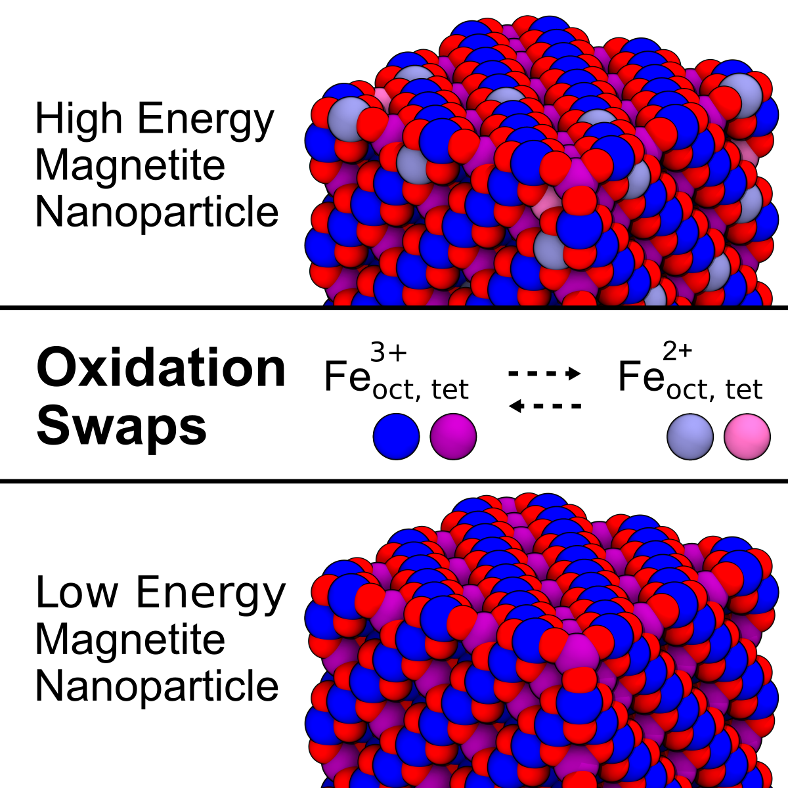

# Magnetite Nanoparticle

[](https://pubs.acs.org/doi/full/10.1021/acs.jpclett.3c01290)  

This repository contains scripts and data related to the nanoparticle section of [**Oxidation-State Dynamics and Emerging Patterns in Magnetite**](https://pubs.acs.org/doi/full/10.1021/acs.jpclett.3c01290)  

[](https://pubs.acs.org/doi/full/10.1021/acs.jpclett.3c01290) 

## Overview  
This repository contains workflows and analysis scripts for studying magnetite nanoparticles. It includes scripts to generate spherical and cubical nanoparticles, hydroxylate undercoordinated Fe ions (spherical), apply corner reconstruction (cubical), and compare reconstructed vs. unreconstructed nanocubes. For both cubical and spherical nanoparticles, minimization and different ensembles are also explored.

## Repository Structure  
```
magnetite_nanoparticle/
│
├── 211020_nanosphere/        # Spherical nanoparticle generation and analysis
│   ├── 1_bare/               
│   │   ├── 1_gen             
│   │   ├── 2_eq              
│   │   ├── 3_hydroxylated/   # Hydroxylation undercoordinated Fe ions
│   ├── 2_water_dissolved/    # Nanoparticle inside water solvation box
│
├── 211020_nanocube/          # Cubical nanoparticle generation and analysis
│   ├── 1_unreconstructed/    # Bulk-carved nanocube
│   ├── 2_reconstructed/      # Corner-reconstructed nanocube
│   ├── 3_figure/            
│ 
└── README.md                                                  
```

## Related Publications  
If you use this repository, please cite the original paper:  
```bibtex
@article{Grsoy2023,
  title = {Oxidation-State Dynamics and Emerging Patterns in Magnetite},
  volume = {14},
  ISSN = {1948-7185},
  url = {http://dx.doi.org/10.1021/acs.jpclett.3c01290},
  DOI = {10.1021/acs.jpclett.3c01290},
  number = {30},
  journal = {The Journal of Physical Chemistry Letters},
  publisher = {American Chemical Society (ACS)},
  author = {G\"{u}rsoy,  Emre and Vonbun-Feldbauer,  Gregor B. and Meißner,  Robert H.},
  year = {2023},
  month = jul,
  pages = {6800–6807}
}
```
